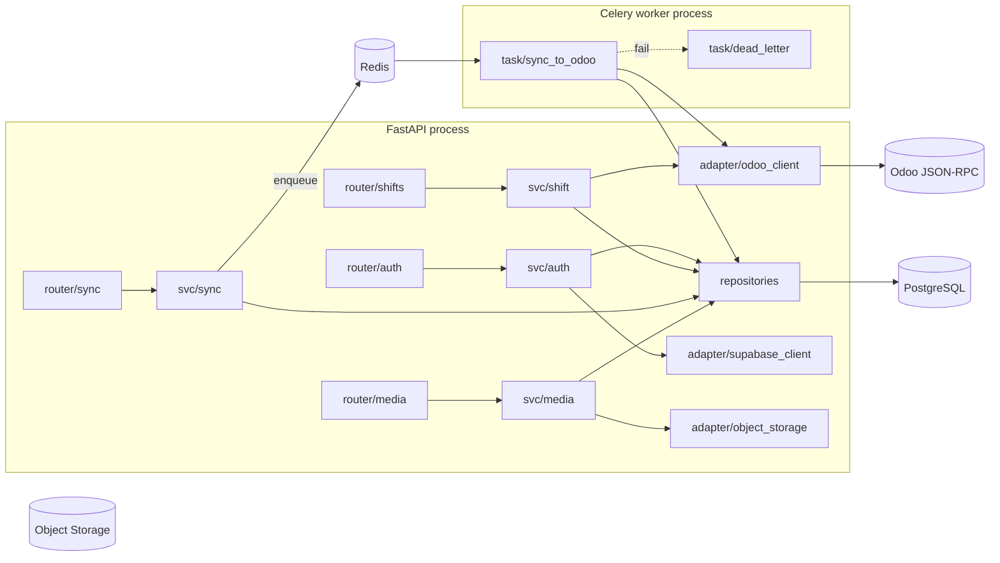

# C4 Level 3 — Backend Components

**Status:** Active  
**Owner:** Backend Lead

## Service layout

```
backend/
├── app/
│   ├── main.py                     # FastAPI app factory
│   ├── settings.py                 # Pydantic Settings (env-driven)
│   ├── deps.py                     # FastAPI dependencies (db session, auth)
│   ├── routers/
│   │   ├── auth.py                 # /auth/exchange, /auth/refresh
│   │   ├── shifts.py               # /shifts, /shifts/{id}
│   │   ├── sync.py                 # /sync/envelope, /sync/status/{client_id}
│   │   ├── media.py                # /media/presign, /media/finalize
│   │   └── health.py               # /healthz, /readyz
│   ├── services/
│   │   ├── auth_service.py         # Supabase JWT verification, internal JWT issuance
│   │   ├── shift_service.py        # reads from Odoo with PG cache
│   │   ├── sync_service.py         # envelope validation, enqueue
│   │   └── media_service.py        # presign + finalize
│   ├── repositories/               # SQLAlchemy / asyncpg data access
│   │   ├── session_repo.py
│   │   ├── envelope_repo.py        # sync_envelopes
│   │   ├── upload_repo.py
│   │   └── shift_cache_repo.py
│   ├── schemas/                    # Pydantic models (request / response)
│   │   ├── auth.py
│   │   ├── shifts.py
│   │   ├── sync.py
│   │   └── media.py
│   ├── workers/                    # Celery tasks
│   │   ├── celery_app.py
│   │   ├── sync_to_odoo.py         # one task per envelope
│   │   ├── retry_policy.py
│   │   └── dead_letter.py
│   ├── adapters/
│   │   ├── odoo_client.py          # JSON-RPC client with circuit breaker
│   │   ├── supabase_client.py      # JWKS verification
│   │   ├── twilio_client.py        # only used by Edge functions; here for fallback
│   │   └── object_storage.py       # boto3 presigned URLs
│   ├── domain/                     # pure Python: entities, errors, value objects
│   ├── middleware/
│   │   ├── auth_middleware.py
│   │   ├── request_id.py
│   │   └── error_handler.py
│   └── observability/
│       ├── logging.py              # JSON logs with correlation IDs
│       ├── metrics.py              # Prometheus
│       └── tracing.py              # OpenTelemetry
├── alembic/                        # DB migrations
├── tests/
│   ├── unit/
│   ├── integration/
│   └── e2e/                        # spins up FastAPI + Postgres + fake Odoo
├── pyproject.toml
└── Dockerfile
```

## Component diagram



## Modules

| Module | Responsibility | Key types |
|---|---|---|
| `routers/auth` | Exchange Supabase JWT for internal JWT, refresh | `AuthExchangeReq`, `AuthExchangeResp` |
| `routers/shifts` | List shifts for current employee, get shift detail | `Shift`, `ShiftDetail` |
| `routers/sync` | Accept sync envelopes, return acceptance status | `SyncEnvelope`, `SyncStatus` |
| `routers/media` | Issue presigned URLs, finalize uploads | `PresignReq`, `PresignResp`, `FinalizeReq` |
| `services/auth_service` | Validate Supabase JWT signature, look up employee, issue internal JWT | — |
| `services/sync_service` | Persist envelope, enqueue Celery task, deduplicate by `client_id` | — |
| `adapters/odoo_client` | All Odoo JSON-RPC calls. Circuit breaker. Retries idempotent reads only | — |
| `adapters/supabase_client` | Verify Supabase JWT via JWKS | — |
| `workers/sync_to_odoo` | Apply envelope to Odoo. Idempotent. Records result | — |
| `workers/dead_letter` | Park envelopes that exceed retry budget for human review | — |

## Cross-cutting

- **Correlation IDs.** Every request gets `X-Request-ID`. Logs and Celery tasks propagate it.
- **Auth.** All routes except `/healthz` and `/readyz` require internal JWT.
- **Validation.** Pydantic v2 strict mode. No silent coercion.
- **Errors.** Single error envelope shape: `{error: {code, message, request_id, details?}}`. See `api-contracts/error-codes.md`.
- **Observability.** JSON logs, Prometheus metrics, OpenTelemetry traces.

## Testing

- **Unit:** services and adapters with mocked dependencies (`pytest`, `respx` for HTTP mocks).
- **Integration:** routers with real Postgres (testcontainers).
- **E2E:** full stack including a fake Odoo (FastAPI app implementing the subset of Odoo JSON-RPC we use).
- **Contract tests:** mobile and backend share JSON schemas in `api-contracts/`.

See `qa/test-strategy.md`.
