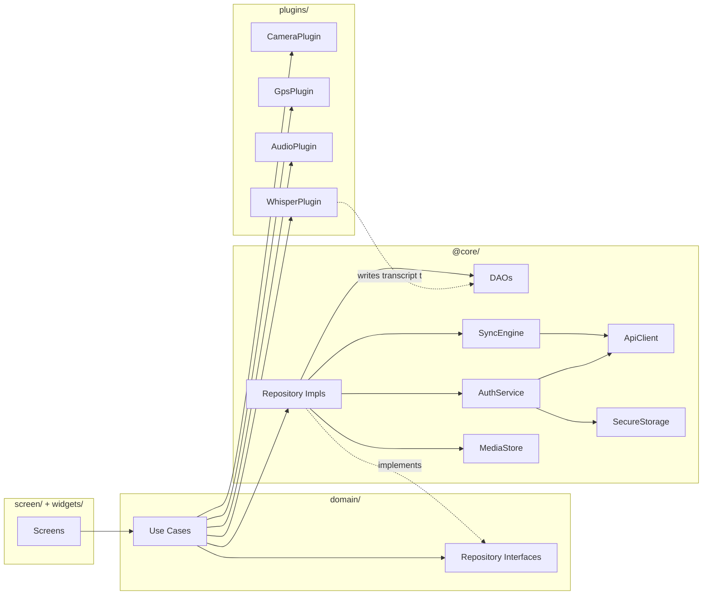

# C4 Level 3 — Mobile Components

**Status:** Active  
**Owner:** Mobile Lead

## Folder structure (layer-first)

```
lib/
├── main.dart                       # tiny entry, runs application/bootstrap.dart
├── application/                    # bootstrap, router, lifecycle, sync orchestrator
│   ├── bootstrap.dart
│   ├── router.dart                 # GoRouter
│   ├── lifecycle.dart              # AppLifecycleState handler (sync trigger on resume)
│   └── sync_orchestrator.dart      # connectivity + queue scheduling glue
│
├── @core/                          # infrastructure (no business rules)
│   ├── db/
│   │   ├── app_database.dart       # Drift / sqflite init
│   │   ├── migrations/             # versioned migrations (1, 2, 3, …)
│   │   └── daos/
│   │       ├── shift_dao.dart
│   │       ├── ppe_dao.dart
│   │       ├── form_response_dao.dart
│   │       ├── media_dao.dart
│   │       ├── voice_note_dao.dart
│   │       ├── gps_event_dao.dart
│   │       └── sync_queue_dao.dart
│   ├── network/
│   │   ├── api_client.dart         # Dio instance with interceptors
│   │   ├── interceptors/auth.dart  # attaches JWT, refreshes on 401
│   │   ├── interceptors/retry.dart # exponential backoff with jitter
│   │   └── error_mapper.dart       # maps HTTP/network errors to domain errors
│   ├── sync/
│   │   ├── sync_engine.dart        # read queue → POST → mark CONFIRMED/FAILED
│   │   ├── envelope_builder.dart   # builds idempotent envelope per row
│   │   ├── retry_policy.dart       # backoff, max attempts, dead-letter rules
│   │   └── background_runner.dart  # WorkManager / BGTaskScheduler wrapper
│   ├── storage/
│   │   ├── secure_storage.dart     # flutter_secure_storage wrapper
│   │   ├── media_store.dart        # filesystem layout for photos/audio
│   │   └── checksum.dart
│   ├── auth/
│   │   ├── auth_service.dart       # OTP request / verify, token refresh
│   │   ├── token_repository.dart
│   │   └── employee_context.dart
│   ├── permissions/
│   │   ├── camera_permission.dart
│   │   ├── microphone_permission.dart
│   │   └── location_permission.dart
│   ├── time/
│   │   └── clock.dart              # injectable clock for testability
│   └── logging/
│       └── logger.dart             # structured logs, redact PII
│
├── @share/                         # lightweight helpers, no deps on @core or domain
│   ├── result.dart                 # Result<T, E>
│   ├── either.dart
│   ├── extensions/
│   └── value_objects/              # PhoneNumber, Coordinates, Duration helpers
│
├── plugins/                        # device adapters
│   ├── camera_plugin.dart          # wraps camera + image_picker
│   ├── gps_plugin.dart             # wraps geolocator
│   ├── audio_plugin.dart           # wraps record + just_audio
│   └── whisper_plugin.dart         # whisper.cpp binding
│
├── resource/                       # design tokens
│   ├── theme.dart
│   ├── colors.dart
│   ├── typography.dart
│   └── spacing.dart
│
├── screen/                         # page-level UI grouped by business area
│   ├── auth/
│   │   ├── login_screen.dart
│   │   └── verify_otp_screen.dart
│   ├── shifts/
│   │   ├── my_shifts_screen.dart
│   │   └── shift_detail_screen.dart
│   ├── field_work/
│   │   ├── ppe_check_in_screen.dart
│   │   ├── pre_shift_form_screen.dart
│   │   ├── work_result_screen.dart
│   │   ├── voice_note_recorder_screen.dart
│   │   └── post_shift_form_screen.dart
│   └── sync_center/
│       └── sync_status_screen.dart
│
├── domain/                         # business types and use cases (pure Dart)
│   ├── entities/
│   ├── repositories/               # abstract interfaces
│   └── use_cases/
│       ├── auth/
│       ├── shifts/
│       ├── capture/
│       └── sync/
│
└── widgets/                        # reusable UI atoms / molecules
    ├── primary_button.dart
    ├── sync_badge.dart             # PENDING / SYNCING / CONFIRMED / FAILED
    ├── photo_thumbnail.dart
    └── form_field_text.dart
```

## Component diagram (Mermaid)



## Layering rules

1. `screen/` and `widgets/` may import `domain/` and `resource/`. Nothing else.
2. `domain/` is pure Dart. No Flutter, no IO, no platform packages.
3. `@core/` may import `domain/` and `@share/`.
4. `plugins/` may import `@share/` only.
5. `application/` is the only place that wires everything together (DI / Riverpod containers).
6. Cross-feature calls go through `domain/use_cases/`, never screen → screen.

## State management

Riverpod 2.x recommended (ADR-006). Providers live in `application/providers/` and are organised by feature. UI never calls DAOs directly; it always goes through a use case.

## Threading

- DB writes happen on a background isolate via Drift's isolate executor (or `compute` for sqflite).
- Image compression and Whisper inference run on background isolates.
- Sync engine is invoked from foreground (on resume) and background (WorkManager / BGTask).

## Testing strategy (per layer)

| Layer | Test type | Tool |
|---|---|---|
| `domain/` | Unit | `flutter_test` |
| `@core/db/` | Integration with in-memory SQLite | `drift_dev` / `sqflite_common_ffi` |
| `@core/sync/` | Unit + integration with mock API | `mocktail` + `dio_test` |
| `screen/` | Widget tests | `flutter_test` |
| End-to-end | Integration test | `integration_test` + `patrol` |

See `qa/test-strategy.md` for the overall approach.
