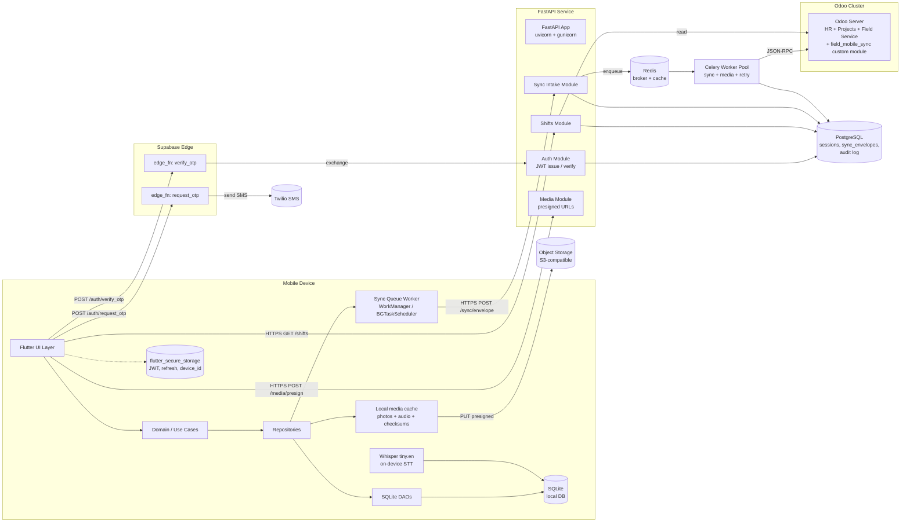

# C4 Level 2 — Container View

**Status:** Active  
**Owner:** Engineering Lead

## Purpose

Show runtime containers (deployable units) and the protocols connecting them.

## Diagram

## Containers

| # | Container | Tech | Responsibility | Persisted state |
|---|---|---|---|---|
| 1 | Flutter UI Layer | Flutter 3.22+ | Screens, navigation | none |
| 2 | Domain / Use Cases | Dart | Business logic, orchestration | none |
| 3 | Repositories | Dart | Read/write coordinator across DAO + queue + remote | none |
| 4 | SQLite DAOs | Drift or sqflite | Typed DB access | none |
| 5 | SQLite local DB | SQLite 3.x | Offline-first store, sync_queue | yes (on-device) |
| 6 | flutter_secure_storage | Keychain (iOS) / Keystore (Android) | JWT, refresh, device_id, encryption keys | yes |
| 7 | Sync Queue Worker | WorkManager (Android) / BGTaskScheduler (iOS) | Drains sync_queue rows to FastAPI | none |
| 8 | Whisper tiny.en | whisper.cpp via flutter binding | On-device voice → text | none |
| 9 | Local media cache | App documents dir | Compressed photos and audio with checksums | yes |
| 10 | Supabase Edge: request_otp | Deno / TypeScript | Validate phone, throttle, send to Twilio | rate-limit state |
| 11 | Supabase Edge: verify_otp | Deno / TypeScript | Verify code, return Supabase JWT | none |
| 12 | Twilio | SaaS | SMS delivery | vendor-side |
| 13 | FastAPI App | Python 3.11 + FastAPI 0.110+ | HTTP API for mobile | none |
| 14 | Auth Module | FastAPI router | Verify Supabase JWT, issue internal JWT | none |
| 15 | Shifts Module | FastAPI router | Read shifts (cached + Odoo lookup) | cache in PG |
| 16 | Sync Intake Module | FastAPI router | Validate envelopes, enqueue jobs | sync_envelopes in PG |
| 17 | Media Module | FastAPI router | Issue presigned upload URLs, finalize uploads | upload metadata in PG |
| 18 | Redis | Redis 7 | Celery broker + short-term cache | yes |
| 19 | Celery Worker Pool | Python 3.11 + Celery | Sync tasks → Odoo, retries, dead-letter | none (state in PG / Redis) |
| 20 | PostgreSQL | PostgreSQL 15 | FastAPI's persistent state | yes |
| 21 | Object Storage | S3-compatible | Photos + voice notes | yes |
| 22 | Odoo Server | Odoo (version TBD, DEC-001) | System of record | yes |

## Protocols

| From | To | Protocol | Auth |
|---|---|---|---|
| Mobile | Supabase Edge | HTTPS | Anon Supabase key |
| Mobile | FastAPI | HTTPS REST + JSON | Internal JWT (Bearer) |
| Mobile | Object Storage | HTTPS PUT (presigned) | Pre-signed URL with TTL |
| Supabase Edge | Twilio | HTTPS | Twilio API key |
| FastAPI | PostgreSQL | TCP / TLS | DB user |
| FastAPI | Redis | TCP / TLS | password |
| Celery | Odoo | HTTPS JSON-RPC | service user + API key |
| FastAPI | Object Storage | HTTPS | IAM role / access key |

## Deployment

See [deployment.md](./deployment.md).

## Why these containers

- **Sync Queue Worker** is split out so background work survives app kill. (ADR-004 indirectly; WorkManager / BGTaskScheduler choice covered in implementation notes.)
- **Celery + Redis** decouple slow Odoo writes from the FastAPI request lifecycle.
- **PostgreSQL** is FastAPI's own state, **not** a copy of Odoo. We never duplicate Odoo's authoritative data; we only cache reads and store sync metadata.
- **Object Storage with presigned URLs** keeps large media bytes out of FastAPI's hot path.
