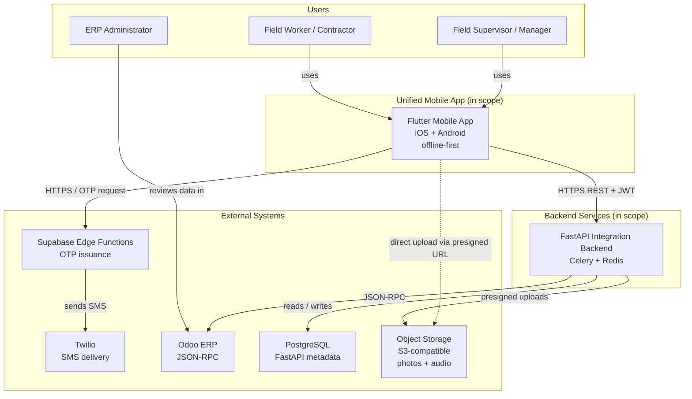

# C4 Level 1 — System Context

**Status:** Active  
**Owner:** Engineering Lead

## Purpose

Show the unified Flutter app in its environment: who uses it, what external systems it depends on.

## Diagram



## Actors

| Actor | Description | Authentication |
|---|---|---|
| **Field Worker** | Performs shifts, captures evidence, completes forms | Phone OTP |
| **Field Supervisor** | Oversees shifts, reviews submissions in Odoo | Phone OTP (mobile) and Odoo SSO (web) |
| **ERP Administrator** | Maintains employees, projects, and Odoo config | Odoo native auth |

## External systems

| System | Why it exists | Owner | SLA expectation |
|---|---|---|---|
| **Supabase Edge Functions** | OTP request handling | Vendor (Supabase) | 99.9 % |
| **Twilio** | SMS delivery for OTP | Vendor (Twilio) | 99.95 % |
| **Odoo ERP** | System of record for HR, projects, tasks | Internal IT | TBD (DEC-008) |
| **PostgreSQL** | FastAPI's metadata (sessions, sync_queue mirror, audit) | DevOps | 99.9 % |
| **Object Storage** | Durable storage for photos and audio | DevOps | 99.95 % |

## Trust boundaries

```
[ Internet ] --- [ Supabase Edge ] --- [ Twilio ]
[ Internet ] --- [ FastAPI ] --- [ Internal: Odoo, Postgres ]
[ Internet ] --- [ S3 (presigned) ]
```

- The mobile app is untrusted. Validate everything server-side.
- Odoo is internal-only. Never expose to internet.
- Object storage uses presigned URLs scoped per upload.

See [non-functional-requirements.md](./non-functional-requirements.md) for SLOs we commit to.
