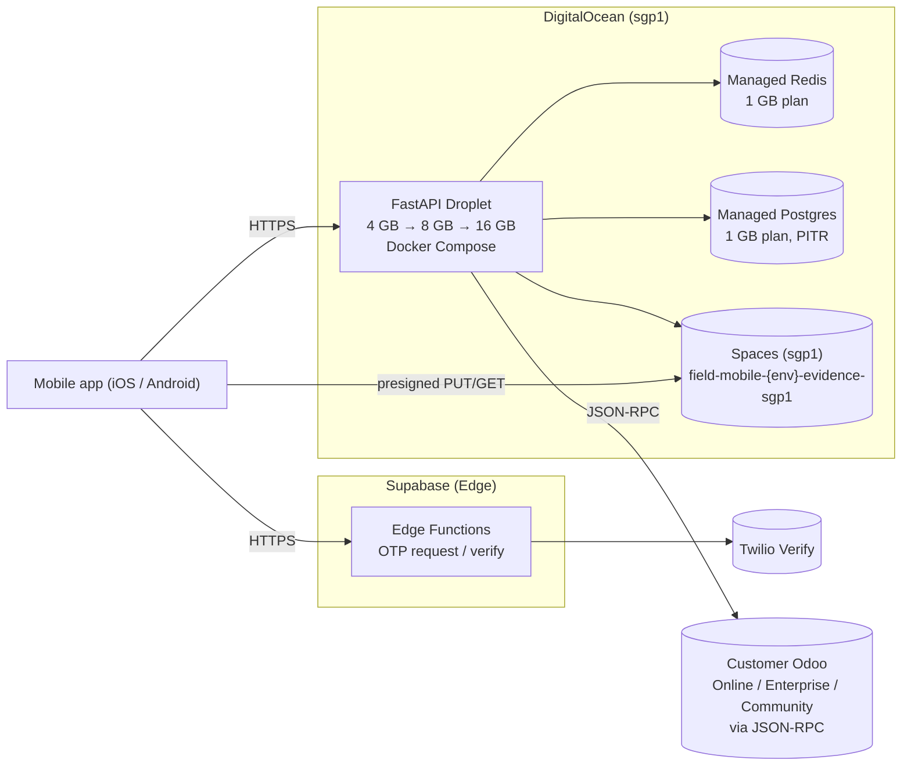

# Deployment Topology

**Status:** Active
**Owner:** DevOps / SRE
**Last updated:** 2026-05-15 (blueprint v2.1.0)
**Consumes:** [DEC-008](../traceability/decision-log.md), [DEC-009](../traceability/decision-log.md), [ADR-012](../adr/ADR-012-aws-s3-object-storage.md), [ADR-015](../adr/ADR-015-no-custom-module-rpc-adapter.md)

## Environments

| Env | Purpose | Mobile build | Backend | Odoo | Data |
|---|---|---|---|---|---|
| **dev** | Engineer machines | local builds | docker-compose (single host) | local Odoo 19 EE Docker | seed data |
| **ci** | Pipeline runs | flutter test, flutter build | services in containers | fake Odoo + Odoo 19 EE matrix | ephemeral |
| **staging** | Pre-prod, QA, demos | TestFlight + Play Internal | DO Droplet (4 GB) + managed Postgres + managed Redis | shared dev/staging Odoo tenant | sanitised data |
| **pilot** | Real users (limited) | TestFlight + Play Internal track | DO Droplet (4 GB) + managed Postgres + managed Redis | customer Odoo (Online / Enterprise / Community) | live (limited) |
| **prod** | Production | App Store + Play Store | DO Droplet (8 GB → 16 GB) + managed Postgres HA + managed Redis | customer Odoo provider's SLA | live |
| **dr** | Disaster recovery | — | warm-standby Droplet in second `sgp1` AZ-equivalent | upstream provider DR | replicated Postgres + Spaces versioning |

> **DEC-008 reminder.** Odoo SLA, scaling, and DR are owned by the customer's Odoo provider (Odoo Online / Odoo.sh / self-host operator). The topology below covers only the integration layer we operate.

## Topology — pilot and production



The FastAPI Droplet runs a Docker Compose stack with three services:

- `web` — FastAPI behind Uvicorn, 2–4 workers depending on Droplet size.
- `worker` — Celery worker pool consuming the Redis broker.
- `beat` — Celery beat for scheduled jobs (capability refresh, GPS retention purge, Odoo summary reconcile).

Caddy or Nginx fronts the stack with TLS termination via Let's Encrypt.

## Compute sizing — DigitalOcean

| Tier | Droplet | vCPU / RAM | FastAPI workers | Celery workers | Suits |
|---|---|---|---|---|---|
| Testing / Staging | s-2vcpu-4gb | 2 / 4 GB | 2 | 2 | Up to 50 concurrent mobile users |
| Pilot | s-2vcpu-4gb | 2 / 4 GB | 2 | 2 | 50–100 active workers |
| Prod year-1 | s-4vcpu-8gb | 4 / 8 GB | 4 | 4 | 100–500 active workers |
| Prod year-2 | s-4vcpu-16gb | 4 / 16 GB | 4 | 8 | 500–1,000 active workers |
| Prod scale-out | DOKS (Kubernetes) | autoscaled | HPA | HPA | > 1,000 active workers OR > 50 concurrent sync requests/sec |

The DOKS migration is intentionally deferred. Capacity plan in `backlog/capacity-plan.md` triggers it at predefined thresholds.

## Managed services — DigitalOcean

| Service | Plan | Notes |
|---|---|---|
| Managed Postgres 16 | `db-s-1vcpu-1gb` (testing/pilot), `db-s-2vcpu-4gb` (prod) | PITR, daily backups 7d retention, optional read replica from prod |
| Managed Redis 7 | `db-s-1vcpu-1gb` | Eviction policy: `volatile-lru` for cache; durable lists used for Celery |
| Spaces | `sgp1` | One bucket per env; CDN endpoint optional for read-heavy assets |

## Cost projection (estimates, sgp1, USD/month)

| Item | Testing / Pilot | Prod year-1 |
|---|---|---|
| FastAPI Droplet | $24 (4 GB) | $48 (8 GB) |
| Managed Postgres | $15 (1 GB) | $60 (4 GB + standby) |
| Managed Redis | $15 (1 GB) | $30 (2 GB) |
| Spaces | $5 base | $5–15 |
| Bandwidth overage (rare) | $0 | $0–10 |
| Backups + monitoring add-ons | $0 (included) | $5 |
| **Total** | **~$59/mo** | **~$148–168/mo** |

Twilio, Supabase, Odoo, and Sentry are billed separately.

## Mobile rollout strategy

- **Internal track:** TestFlight (iOS) + Play Internal Testing (Android). Used by team and pilot site.
- **Closed track:** Play Closed Testing for pilot expansion (50–200 users).
- **Open / production:** App Store + Play production. Phased rollout 5 % → 25 % → 50 % → 100 % over 5 days.
- **Force update:** Server returns `min_app_version` header on `/v1/auth/exchange`. Below threshold, app shows blocking update screen.

## CI/CD pipelines

### Backend

```
PR opened
 └─ lint (ruff)
 └─ type check (mypy --strict)
 └─ unit tests
 └─ integration tests (testcontainers Postgres + Redis)
 └─ e2e tests (Odoo 19 EE Docker)
 └─ build container image
 └─ push to DO container registry (tag = git sha)
On merge to main
 └─ deploy to staging Droplet (auto, doctl + compose pull)
 └─ run smoke tests on staging (Odoo probe + sync round-trip)
On tag v*
 └─ deploy to pilot/prod Droplet (manual approval)
 └─ run Alembic migration step
 └─ run smoke tests
 └─ swap traffic via Caddy / Droplet load balancer
Weekly nightly
 └─ smoke matrix: Odoo 17 Community, Odoo 19 EE — assert capability fallback paths
```

### Mobile

```
PR opened
 └─ dart format check
 └─ flutter analyze
 └─ flutter test (unit + widget)
 └─ flutter build apk --debug (smoke)
On merge to main
 └─ build release apk + ipa (signed)
 └─ upload to Play Internal + TestFlight (auto)
 └─ run integration tests on Firebase Test Lab + Play Console pre-launch
On tag v*
 └─ promote to closed/open track per release-plan.md
```

## Secrets

- Stored in **DigitalOcean Vault** (or HashiCorp Vault sidecar for environments that need OIDC federation).
- CI receives short-lived tokens via DO API; long-lived keys are not embedded in pipeline configs.
- Rotation policy: 90 days for API keys (Spaces, Twilio, Odoo), 30 days for service-account tokens.
- See `security/secrets.md`.

## Observability

- **Logs:** Loki on a small monitoring Droplet (or DO Managed Insights when promoted to prod).
- **Metrics:** Prometheus → Grafana dashboards: API RED, Celery queue depth, sync success rate, Odoo RPC error rate, GPS ping rate.
- **Tracing:** OpenTelemetry → Tempo.
- **Crash reporting:** Sentry for mobile.
- **Synthetic monitoring:** every 60 s ping `/healthz` and a known-good `/sync/envelope` shadow.
- **Capability probe alerts:** any `ProbeReport` with `ready_for_writes: false` pages on-call.

## Capacity (pilot vs prod year-1)

| Resource | Pilot | Prod year-1 |
|---|---|---|
| FastAPI workers | 2 (single 4 GB Droplet) | 4 (single 8 GB Droplet) |
| Celery workers | 2 (single 4 GB Droplet) | 4 (single 8 GB Droplet) |
| Managed Postgres | 1 GB | 4 GB + standby |
| Managed Redis | 1 GB | 2 GB |
| Object storage | Spaces base 250 GB included | Spaces 250 GB + overage |

## Disaster recovery (integration layer)

- **RPO target:** 15 minutes (Postgres PITR).
- **RTO target:** 2 hours (warm-standby Droplet image + Spaces versioning).
- **Strategy:**
  - Managed Postgres PITR provides 7-day rewind window.
  - Spaces bucket versioning keeps object history.
  - Warm-standby Droplet kept image-current (weekly snapshot) in a second `sgp1` data centre.
  - Compose stack rebuildable from `infra/compose/` in the repo plus secrets vault.
- **DR drills:** quarterly during prod phase; documented in `runbooks/incident-response.md`.

## Odoo side (out of our SLA — DEC-008)

The customer's Odoo tenant runs on:

- **Odoo Online** — Odoo SAS-managed SLA. We integrate via published JSON-RPC. No infra responsibility on our side.
- **Odoo.sh** — Odoo SAS-managed PaaS. Same RPC contract.
- **Self-hosted Enterprise / Community** — operator-defined SLA. We treat outages as upstream incidents.

Mobile sync queue holds writes during Odoo unavailability; on recovery, the FastAPI Celery worker drains with exponential backoff. Capability probe re-runs automatically after a probe failure window of 5 minutes.
