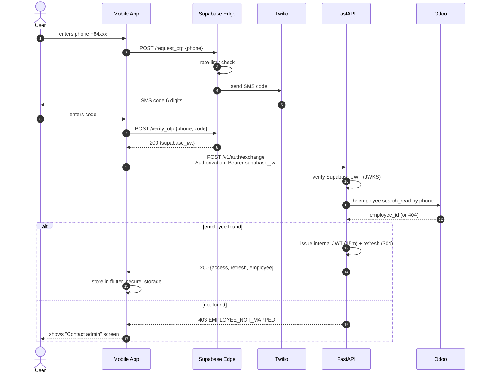
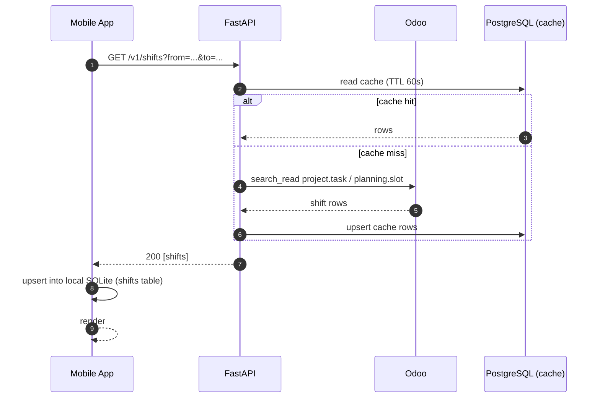
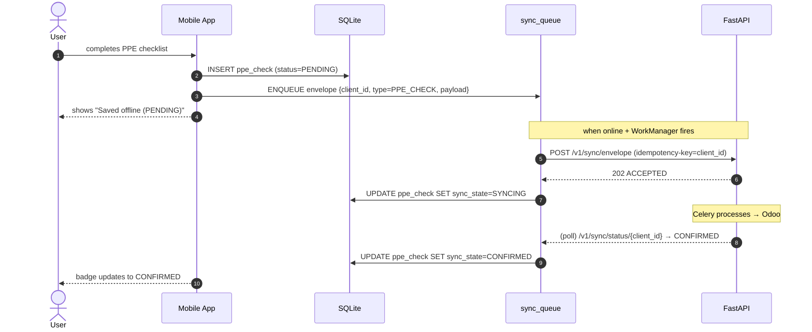
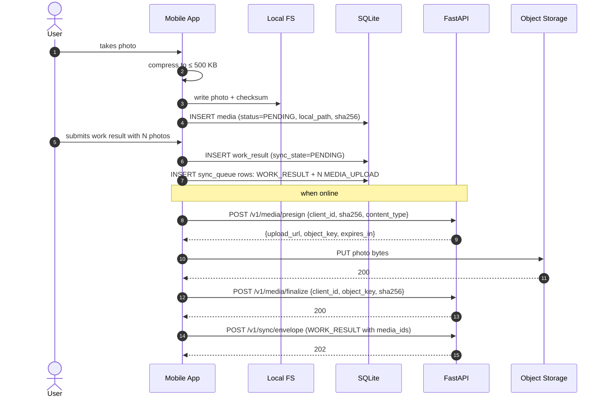
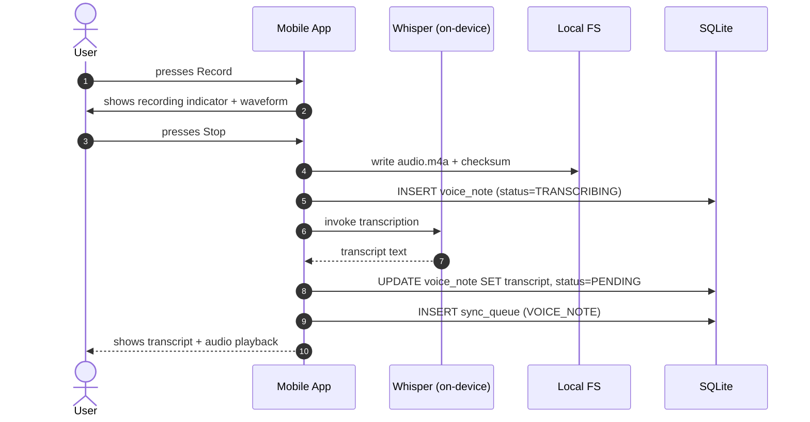
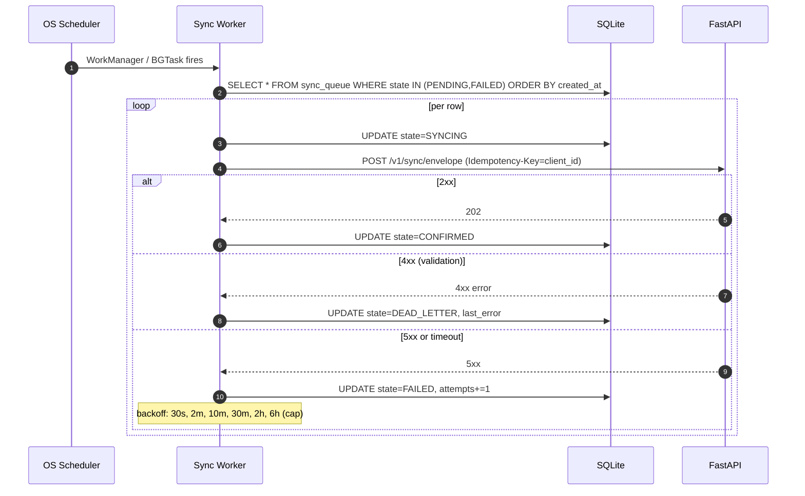
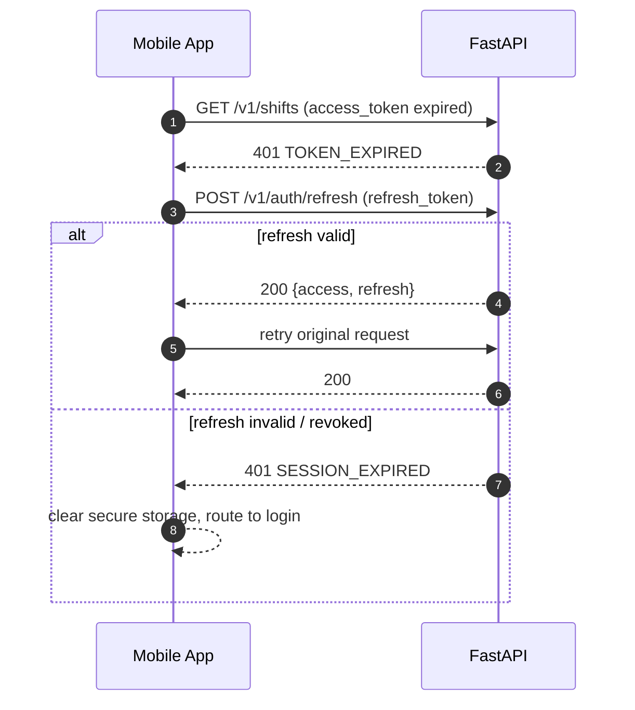
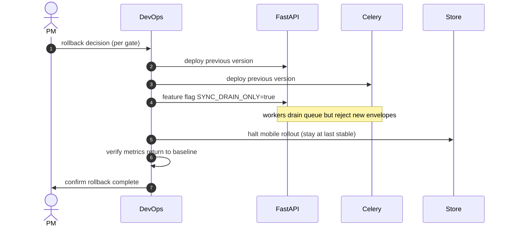

# Sequence Flows

**Status:** Active  
**Owner:** Engineering Lead

Critical sequences described as Mermaid diagrams. Each links to the relevant FR, story, and test case.

## 1. Login + OTP verification

**Maps to:** FR-001, FR-002 · EPIC-02 · US-AUTH-001..005 · TC-AUTH-001..006

## 2. Shift list (read-with-cache)

**Maps to:** FR-004 · EPIC-03 · US-SHIFT-001 · TC-SHIFT-001

## 3. PPE check-in (offline-tolerant)

**Maps to:** FR-006 · EPIC-05 · US-CAP-001 · TC-PPE-001

## 4. Work result with photos (capture + upload)

**Maps to:** FR-009, FR-010 · EPIC-05/06 · US-CAP-010..012 · TC-MEDIA-001..006

## 5. Voice note + Whisper transcription

**Maps to:** FR-011 · EPIC-06 · US-VOICE-001..004 · TC-VOICE-001..005

## 6. Background sync (resume from kill)

**Maps to:** FR-012, FR-013, FR-014 · EPIC-06 · US-SYNC-001..006 · TC-SYNC-001..010

## 7. Token refresh on 401

**Maps to:** FR-003 · EPIC-02 · US-AUTH-006 · TC-AUTH-007

## 8. Pilot rollback

**Maps to:** runbooks/rollback.md

