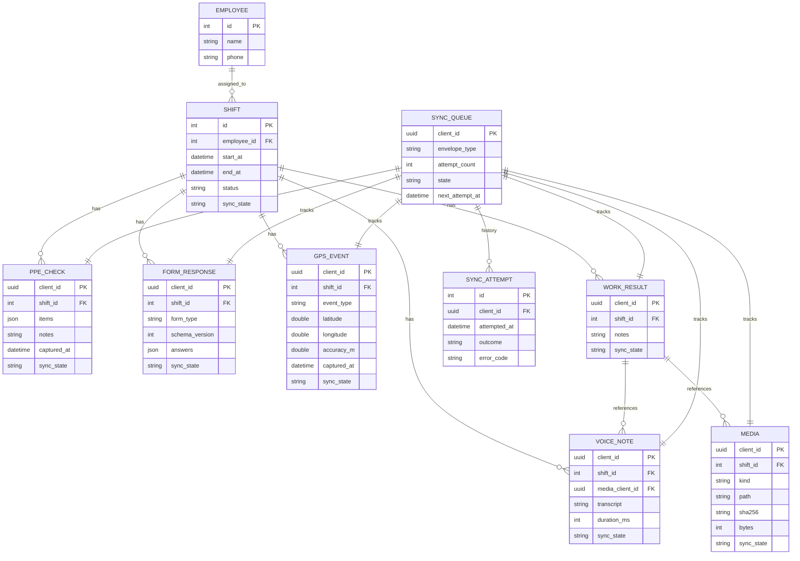
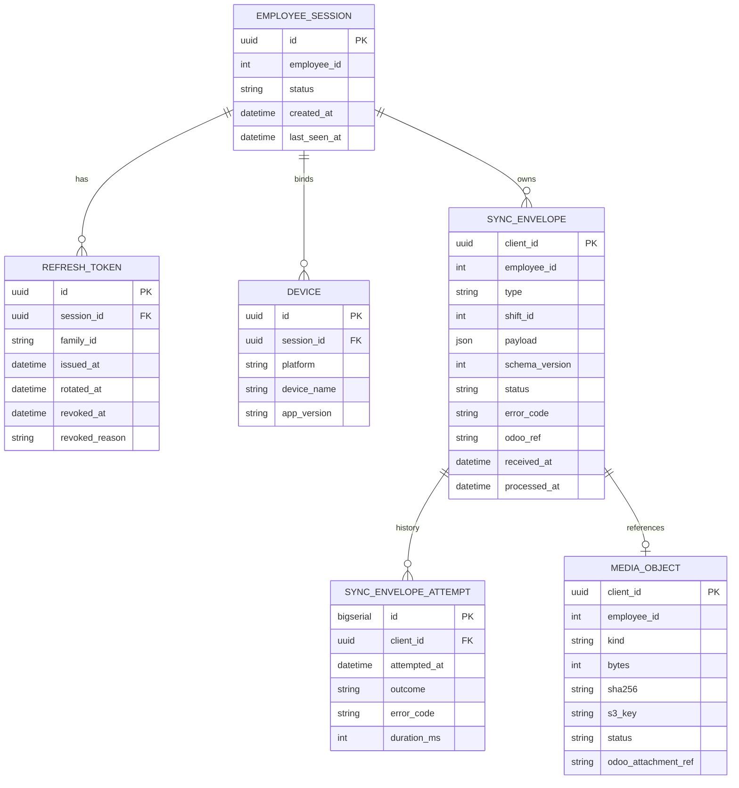
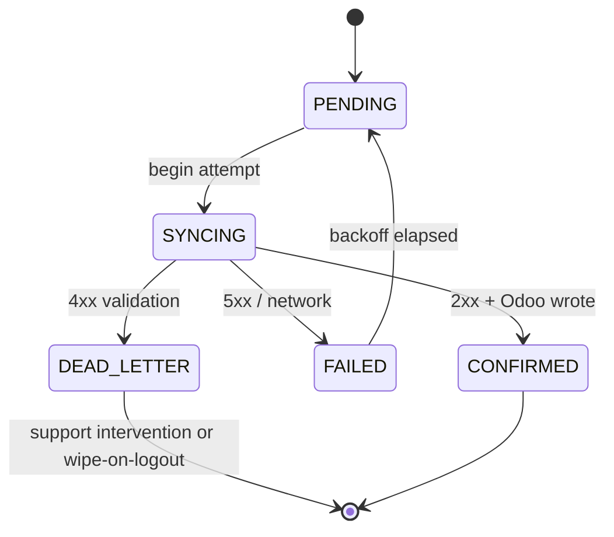

# Entity-Relationship Diagrams

**Status:** Active
**Owner:** Backend Lead + Mobile Lead

Visual references for the data models. Source of truth for column-level detail is `data/sqlite-schema.md`, `data/postgres-schema.md`, and `data/odoo-mapping.md`.

## Mobile (SQLite)

## Backend (Postgres)

## Sync state machine (visual reference)

## How to keep these in sync

- Any column added in `sqlite-schema.md` or `postgres-schema.md` must update the matching ERD entity here.
- Lint reviews check these diagrams compile via `mermaid-cli` in CI.
- ERDs are illustrative; the schema files are normative when conflicts occur.
