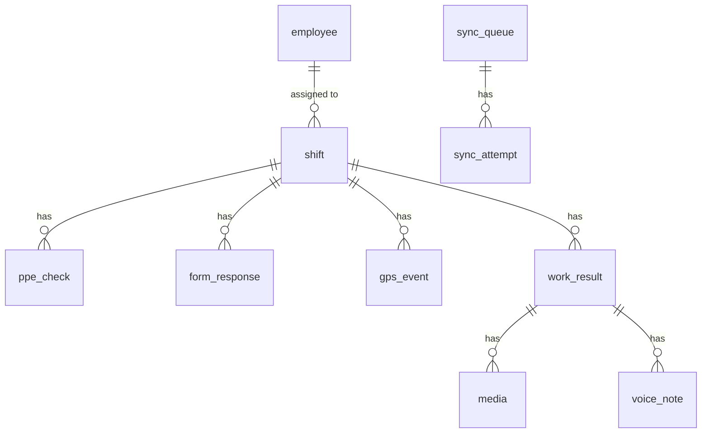

# SQLite Schema (Mobile)

**Status:** Active  
**Owner:** Mobile Lead  
**Last updated:** 2026-05-13

This is the authoritative SQLite schema for the mobile app. All migrations are versioned and live under `mobile/lib/@core/db/migrations/`.

## Conventions

- Tables: `snake_case`, plural.
- PK: `id` (INTEGER autoincrement) **plus** `client_id` (TEXT, UUID v4) on every row that participates in sync.
- Timestamps: `created_at`, `updated_at` (INTEGER unix ms).
- Soft deletes: `deleted_at` (NULL when alive).
- Sync state: `sync_state` (TEXT) on every syncable row. Enum: `PENDING`, `SYNCING`, `CONFIRMED`, `FAILED`, `DEAD_LETTER`.
- Foreign keys enabled (`PRAGMA foreign_keys = ON`).
- WAL mode enabled (`PRAGMA journal_mode = WAL`).

## ERD (Mermaid)



## Schema

### `employee`

Stores the authenticated user's employee record (single row in MVP).

```sql
CREATE TABLE employee (
    id              INTEGER PRIMARY KEY,           -- Odoo hr.employee.id
    name            TEXT NOT NULL,
    phone           TEXT NOT NULL,
    department      TEXT,
    job_title       TEXT,
    avatar_url      TEXT,
    last_synced_at  INTEGER NOT NULL,
    created_at      INTEGER NOT NULL,
    updated_at      INTEGER NOT NULL
);
CREATE UNIQUE INDEX idx_employee_phone ON employee(phone);
```

### `shift`

```sql
CREATE TABLE shift (
    id              INTEGER PRIMARY KEY AUTOINCREMENT,
    odoo_id         INTEGER UNIQUE,                -- project.task.id (or planning.slot.id, per DEC-002)
    employee_id     INTEGER NOT NULL REFERENCES employee(id),
    title           TEXT NOT NULL,
    site_name       TEXT,
    site_address    TEXT,
    project_id      INTEGER,
    project_name    TEXT,
    start_at        INTEGER NOT NULL,              -- planned start (unix ms)
    end_at          INTEGER NOT NULL,              -- planned end
    actual_start_at INTEGER,                       -- worker's actual start (set on PPE+pre-shift submit)
    actual_end_at   INTEGER,                       -- worker's actual end (set on post-shift submit)
    status          TEXT NOT NULL,                 -- DRAFT, IN_PROGRESS, COMPLETED, CANCELLED
    server_status   TEXT,                          -- mirror of Odoo state
    last_synced_at  INTEGER,
    created_at      INTEGER NOT NULL,
    updated_at      INTEGER NOT NULL,
    deleted_at      INTEGER
);
CREATE INDEX idx_shift_employee ON shift(employee_id);
CREATE INDEX idx_shift_start_at ON shift(start_at);
```

### `ppe_check`

```sql
CREATE TABLE ppe_check (
    id              INTEGER PRIMARY KEY AUTOINCREMENT,
    client_id       TEXT NOT NULL UNIQUE,          -- UUID v4
    shift_id        INTEGER NOT NULL REFERENCES shift(id),
    employee_id     INTEGER NOT NULL,
    items_json      TEXT NOT NULL,                 -- JSON array of {key, label, checked}
    notes           TEXT,
    captured_at     INTEGER NOT NULL,
    sync_state      TEXT NOT NULL DEFAULT 'PENDING',
    server_id       INTEGER,                       -- Odoo record id once CONFIRMED
    created_at      INTEGER NOT NULL,
    updated_at      INTEGER NOT NULL,
    deleted_at      INTEGER
);
CREATE INDEX idx_ppe_shift ON ppe_check(shift_id);
CREATE INDEX idx_ppe_state ON ppe_check(sync_state);
```

### `form_response`

```sql
CREATE TABLE form_response (
    id              INTEGER PRIMARY KEY AUTOINCREMENT,
    client_id       TEXT NOT NULL UNIQUE,
    shift_id        INTEGER NOT NULL REFERENCES shift(id),
    form_type       TEXT NOT NULL,                 -- 'PRE_SHIFT' | 'POST_SHIFT'
    schema_version  TEXT NOT NULL,                 -- e.g. 'pre-shift-v1'
    answers_json    TEXT NOT NULL,                 -- JSON object keyed by field id
    submitted_at    INTEGER NOT NULL,
    sync_state      TEXT NOT NULL DEFAULT 'PENDING',
    server_id       INTEGER,
    created_at      INTEGER NOT NULL,
    updated_at      INTEGER NOT NULL,
    deleted_at      INTEGER
);
CREATE INDEX idx_form_shift_type ON form_response(shift_id, form_type);
CREATE INDEX idx_form_state ON form_response(sync_state);
```

### `gps_event`

```sql
CREATE TABLE gps_event (
    id              INTEGER PRIMARY KEY AUTOINCREMENT,
    client_id       TEXT NOT NULL UNIQUE,
    shift_id        INTEGER NOT NULL REFERENCES shift(id),
    event_type      TEXT NOT NULL,                 -- 'CHECK_IN' | 'CHECK_OUT' | 'WAYPOINT'
    latitude        REAL NOT NULL,
    longitude       REAL NOT NULL,
    accuracy_m      REAL,
    altitude_m      REAL,
    captured_at     INTEGER NOT NULL,
    sync_state      TEXT NOT NULL DEFAULT 'PENDING',
    created_at      INTEGER NOT NULL,
    updated_at      INTEGER NOT NULL
);
CREATE INDEX idx_gps_shift ON gps_event(shift_id);
CREATE INDEX idx_gps_state ON gps_event(sync_state);
```

### `work_result`

```sql
CREATE TABLE work_result (
    id              INTEGER PRIMARY KEY AUTOINCREMENT,
    client_id       TEXT NOT NULL UNIQUE,
    shift_id        INTEGER NOT NULL REFERENCES shift(id),
    notes           TEXT,
    completion_pct  INTEGER,                       -- 0..100, optional
    submitted_at    INTEGER NOT NULL,
    sync_state      TEXT NOT NULL DEFAULT 'PENDING',
    server_id       INTEGER,
    created_at      INTEGER NOT NULL,
    updated_at      INTEGER NOT NULL,
    deleted_at      INTEGER
);
CREATE INDEX idx_wr_shift ON work_result(shift_id);
CREATE INDEX idx_wr_state ON work_result(sync_state);
```

### `media`

Photos and other binary attachments.

```sql
CREATE TABLE media (
    id              INTEGER PRIMARY KEY AUTOINCREMENT,
    client_id       TEXT NOT NULL UNIQUE,
    work_result_id  INTEGER REFERENCES work_result(id),
    shift_id        INTEGER NOT NULL REFERENCES shift(id),
    kind            TEXT NOT NULL,                 -- 'PHOTO' (MVP), later 'VIDEO'
    local_path      TEXT NOT NULL,                 -- relative to app docs dir
    sha256          TEXT NOT NULL,
    bytes           INTEGER NOT NULL,
    mime_type       TEXT NOT NULL,
    width_px        INTEGER,
    height_px       INTEGER,
    captured_at     INTEGER NOT NULL,
    upload_state    TEXT NOT NULL DEFAULT 'PENDING', -- PENDING | UPLOADING | UPLOADED | FAILED
    object_key      TEXT,                          -- S3 key after presign
    sync_state      TEXT NOT NULL DEFAULT 'PENDING',
    created_at      INTEGER NOT NULL,
    updated_at      INTEGER NOT NULL,
    deleted_at      INTEGER
);
CREATE INDEX idx_media_work ON media(work_result_id);
CREATE INDEX idx_media_state ON media(sync_state);
CREATE INDEX idx_media_upload ON media(upload_state);
```

### `voice_note`

```sql
CREATE TABLE voice_note (
    id                  INTEGER PRIMARY KEY AUTOINCREMENT,
    client_id           TEXT NOT NULL UNIQUE,
    work_result_id      INTEGER REFERENCES work_result(id),
    shift_id            INTEGER NOT NULL REFERENCES shift(id),
    local_path          TEXT NOT NULL,
    sha256              TEXT NOT NULL,
    duration_ms         INTEGER NOT NULL,
    transcript          TEXT,
    transcript_status   TEXT NOT NULL DEFAULT 'PENDING', -- PENDING | TRANSCRIBING | DONE | FAILED
    object_key          TEXT,
    upload_state        TEXT NOT NULL DEFAULT 'PENDING',
    sync_state          TEXT NOT NULL DEFAULT 'PENDING',
    captured_at         INTEGER NOT NULL,
    created_at          INTEGER NOT NULL,
    updated_at          INTEGER NOT NULL,
    deleted_at          INTEGER
);
CREATE INDEX idx_vn_work ON voice_note(work_result_id);
CREATE INDEX idx_vn_state ON voice_note(sync_state);
```

### `sync_queue`

The durable queue of envelopes to send.

```sql
CREATE TABLE sync_queue (
    id              INTEGER PRIMARY KEY AUTOINCREMENT,
    client_id       TEXT NOT NULL UNIQUE,          -- mirrors source row's client_id
    envelope_type   TEXT NOT NULL,                 -- PPE_CHECK | FORM_RESPONSE | GPS_EVENT | WORK_RESULT | MEDIA_FINALIZE | VOICE_NOTE
    source_table    TEXT NOT NULL,
    source_id       INTEGER NOT NULL,
    payload_json    TEXT NOT NULL,                 -- canonical envelope body
    state           TEXT NOT NULL DEFAULT 'PENDING', -- PENDING | SYNCING | CONFIRMED | FAILED | DEAD_LETTER
    attempts        INTEGER NOT NULL DEFAULT 0,
    next_attempt_at INTEGER,                       -- unix ms; null = run immediately
    last_error      TEXT,
    last_error_code TEXT,
    created_at      INTEGER NOT NULL,
    updated_at      INTEGER NOT NULL
);
CREATE INDEX idx_sq_state ON sync_queue(state);
CREATE INDEX idx_sq_next ON sync_queue(next_attempt_at);
```

### `sync_attempt`

Audit trail per attempt.

```sql
CREATE TABLE sync_attempt (
    id              INTEGER PRIMARY KEY AUTOINCREMENT,
    queue_id        INTEGER NOT NULL REFERENCES sync_queue(id) ON DELETE CASCADE,
    started_at      INTEGER NOT NULL,
    finished_at     INTEGER,
    outcome         TEXT NOT NULL,                 -- SUCCESS | TRANSIENT_FAIL | PERMANENT_FAIL
    http_status     INTEGER,
    error_code      TEXT,
    error_message   TEXT
);
CREATE INDEX idx_sa_queue ON sync_attempt(queue_id);
```

### `kv_store`

Tiny generic key-value table for misc app state (not for sensitive data — that goes in secure storage).

```sql
CREATE TABLE kv_store (
    key             TEXT PRIMARY KEY,
    value           TEXT NOT NULL,
    updated_at      INTEGER NOT NULL
);
```

## Migrations

Version starts at 1 (initial schema). Subsequent migrations live as files `migrations/v2.dart`, `v3.dart`, etc. with up + down functions. Drift handles versioning.

### Migration policy

- Every PR that changes schema includes the migration and a test that:
  - Creates v(n-1) DB.
  - Applies migration.
  - Verifies data integrity.
- Down migrations are best-effort. We rely on roll-forward in production.
- Breaking column drops require dual-write strategy across two app versions.

## Indexes performance budget

For 100 active shifts and 10k captures, p95 query latency targets:

| Query | Target |
|---|---|
| List PENDING sync_queue | ≤ 5 ms |
| List shifts for employee in date range | ≤ 10 ms |
| Read shift detail with all captures | ≤ 30 ms |

If exceeded, add index, profile with `EXPLAIN QUERY PLAN`.

## Encryption

- Database file resides in app sandbox (encrypted at rest by OS).
- A symmetric key for sensitive columns (transcripts, notes) is stored in `flutter_secure_storage` and used at the app layer to encrypt before insert. (Optional in MVP; mandatory for prod.)

## Backup

- No app-level backup. Reliance on sync (durable through FastAPI → Odoo + S3).
- Local DB is wiped on logout for security.
