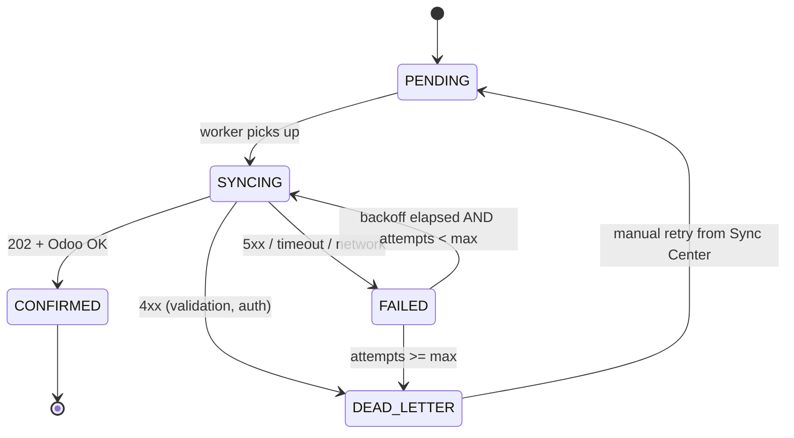

# Sync State Machine

**Status:** Active  
**Owner:** Mobile Lead + Backend Lead

This is the formal automaton for the `sync_state` column on every syncable row, and the matching state for `sync_queue.state`.

## States

| State | Meaning | Where visible |
|---|---|---|
| `PENDING` | Captured locally, not yet sent | Mobile + Backend |
| `SYNCING` | Sent to FastAPI, awaiting confirmation | Mobile (transient) |
| `CONFIRMED` | FastAPI accepted **and** Odoo wrote successfully | Mobile + Backend |
| `FAILED` | Last attempt failed; will retry per backoff | Mobile + Backend |
| `DEAD_LETTER` | Exceeded retry budget OR backend rejected with 4xx | Mobile + Backend |

## State diagram



## Transition rules

| From | To | Trigger | Side effects |
|---|---|---|---|
| `PENDING` | `SYNCING` | Worker selects row | Increment `attempts`, set `started_at` |
| `SYNCING` | `CONFIRMED` | Backend returns 200 with status `CONFIRMED` (or 202 + later poll = CONFIRMED) | Source row's `server_id` set; sync_queue row archived |
| `SYNCING` | `FAILED` | 5xx, timeout, connection error | `next_attempt_at = now + backoff(attempts)` |
| `SYNCING` | `DEAD_LETTER` | 4xx (except 401 which triggers refresh) | Persist `last_error`; surface to user |
| `FAILED` | `SYNCING` | Worker fires after `next_attempt_at` AND `attempts < max_attempts` | as above |
| `FAILED` | `DEAD_LETTER` | `attempts >= max_attempts` | Surface to user |
| `DEAD_LETTER` | `PENDING` | User taps Retry in Sync Center | Reset `attempts`, clear `last_error` |

## Backoff schedule

```
attempts  |  delay (s)   |  delay (human)
----------|--------------|----------------
1         |        30    |  30s
2         |       120    |  2m
3         |       600    |  10m
4         |      1800    |  30m
5         |      7200    |  2h
6         |     21600    |  6h  (cap)
≥ 7       |  → DEAD_LETTER (max_attempts = 6 by default)
```

Add jitter ±20 % to avoid retry storms.

## Idempotency contract (mobile ↔ backend)

- Mobile generates `client_id` (UUID v4) at the moment of capture.
- Mobile sends `client_id` in:
  - The envelope payload field `client_id`.
  - The HTTP header `Idempotency-Key`.
- FastAPI dedupes on `(employee_id, client_id)`:
  - First call: insert envelope, enqueue Celery, return `202` with status `PENDING`.
  - Subsequent identical calls: short-circuit, return current status without re-enqueueing.
- Celery looks up Odoo by `external_id = client_id`:
  - If exists: update; do not create.
  - If missing: create with `external_id = client_id`.
- Odoo result returns to FastAPI which sets envelope status to `CONFIRMED` or `DEAD_LETTER`.

## Status query

Mobile can poll `GET /v1/sync/status/{client_id}` to ask the server's view. Server returns one of:

```json
{ "status": "PENDING" }
{ "status": "PROCESSING" }
{ "status": "CONFIRMED", "odoo_ref": "project.task,123" }
{ "status": "DEAD_LETTER", "error_code": "VALIDATION_FAILED", "error_message": "..." }
```

## Failure taxonomy

| Class | HTTP | Mobile action | Example |
|---|---|---|---|
| **Auth** | 401 | refresh token, retry once; if still 401 → re-login | `TOKEN_EXPIRED` |
| **Validation** | 400 / 422 | DEAD_LETTER + surface error | `MISSING_FIELD`, `INVALID_GEO` |
| **Forbidden** | 403 | DEAD_LETTER | `EMPLOYEE_NOT_MAPPED` |
| **Conflict** | 409 | treat as success (already exists) | `DUPLICATE_CLIENT_ID` |
| **Rate limit** | 429 | FAILED with backoff at least the `Retry-After` value | `RATE_LIMIT` |
| **Server** | 5xx | FAILED, exponential backoff | `INTERNAL_ERROR` |
| **Network** | timeout / DNS / TLS | FAILED, exponential backoff | `NETWORK` |

See `api-contracts/error-codes.md` for the full list.

## Observability requirements

- Mobile logs every state transition with `client_id`, `envelope_type`, `attempts`, `outcome`.
- Sentry receives any `DEAD_LETTER` event with PII redacted.
- Backend Prometheus metrics:
  - `sync_envelope_received_total{type}`
  - `sync_envelope_state{state}`
  - `sync_envelope_age_seconds` histogram
  - `celery_task_outcome_total{outcome}`
- Sync Center screen shows counts per state and a list of DEAD_LETTER rows with retry button.

## Tests

- Unit: state transitions in `core/sync/sync_engine.dart`.
- Integration: full PENDING → CONFIRMED loop using fake backend.
- Chaos: forced 5xx, forced timeout, force-kill mid-`SYNCING`, ensure no row left in `SYNCING` after restart (recovery rule below).

## Recovery rule (app start / process resume)

On app start or `AppLifecycleState.resumed`, sync engine runs:

```sql
UPDATE sync_queue
SET state = 'FAILED', last_error = 'INTERRUPTED'
WHERE state = 'SYNCING';
```

This guarantees no row is permanently stuck in `SYNCING`.
